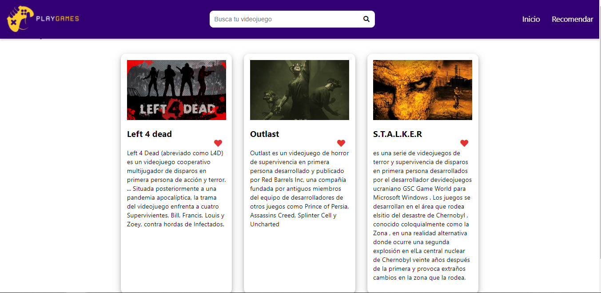
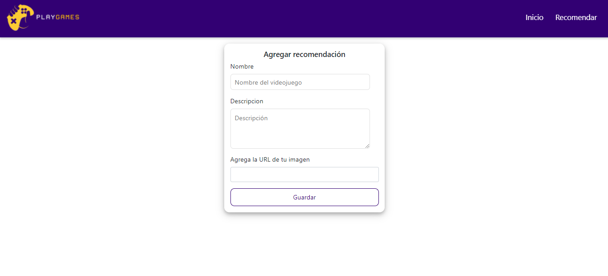
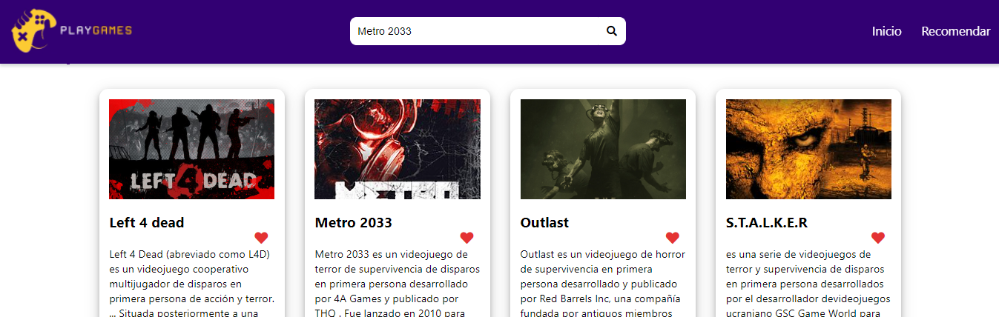
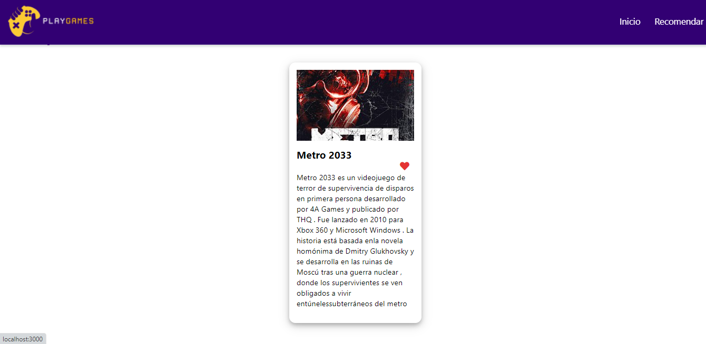
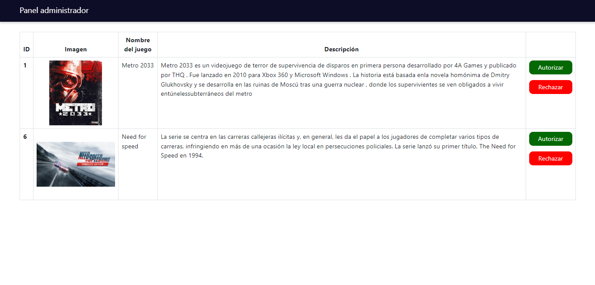

# Videogame city
Este proyecto fue desarrollado con node js y express, consiste en dos partes, la primera es un sitio público donde se visualizan todos los videojuegos que se han recomendado y otra parte el panel de administrador el cual autoriza o rechaza las recomendaciones.

# Capturas

* ## Sitio público:
Home del sitio donde se visualizan todos los videojuegos que han sido recomendados.

En esta sección se crea una recomendación.

Aquí permite realizar una búsqueda.

Y nos arrojará los resultados de la búsqueda.

* ## Panel administrativo

El administrador podrá ver todas las recomendaciones que le han llegado para posterior aprobarlas o rechazarlas.
